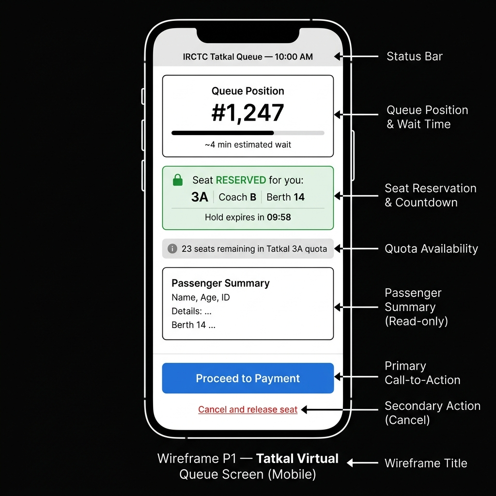
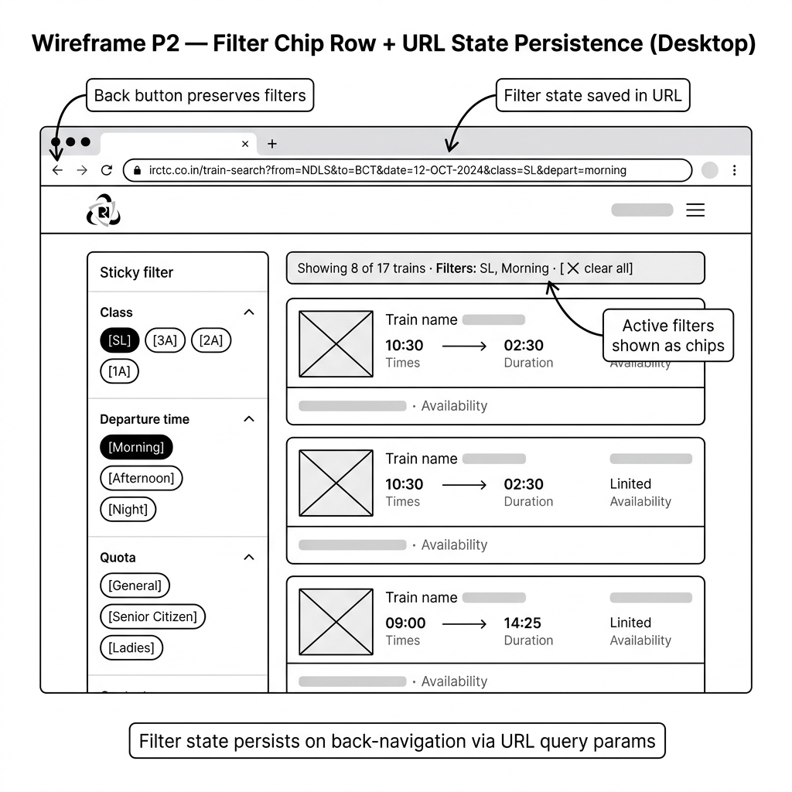
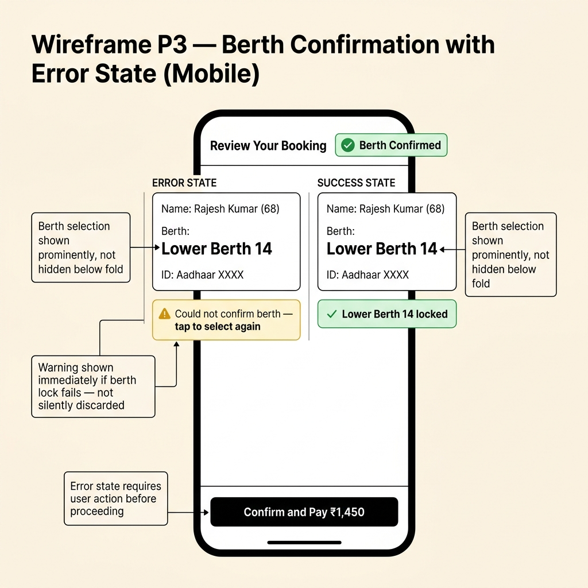
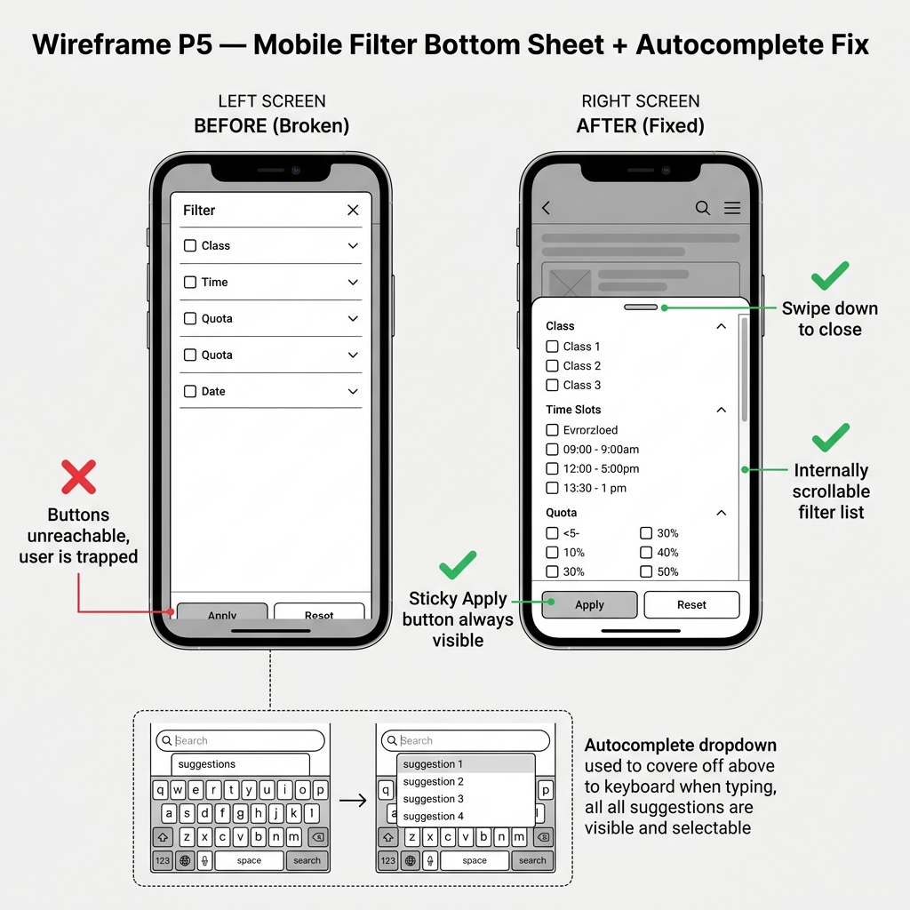
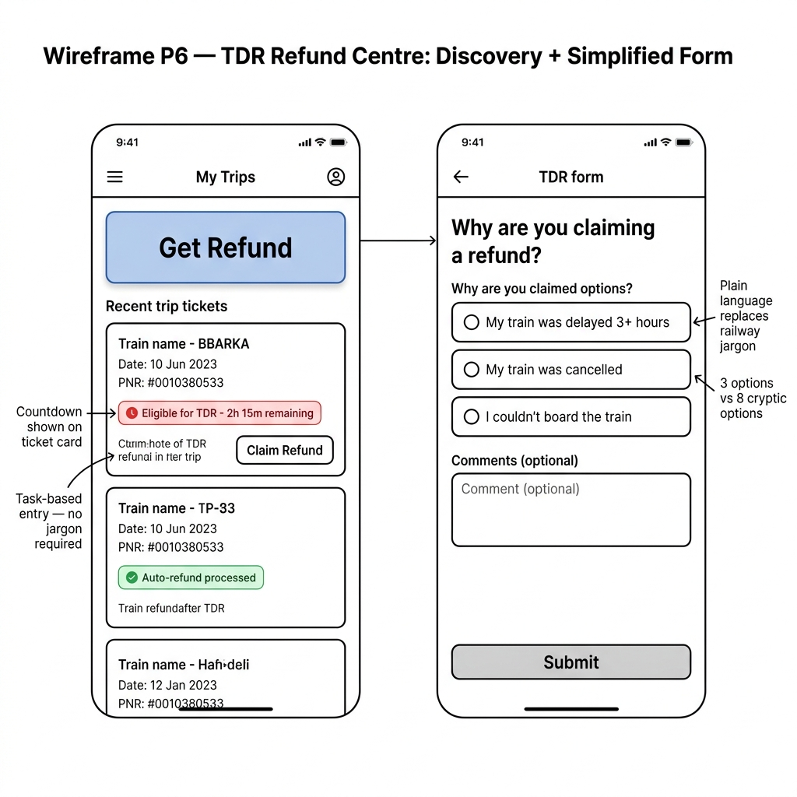

# IRCTC Feature Specifications — Part B

> Every spec in this document directly references the broken flows documented in
> `part-a/PROBLEMS.md`. This is not a separate discovery — it is the sprint response.

---

## Feature Spec 1: Tatkal Virtual Queue System

### Problem Statement
As documented in `part-a/PROBLEMS.md § Problem 1`, the IRCTC Tatkal booking window at 10:00 AM causes a server-crashing "digital stampede" every day. 15–20 lakh users hit the platform simultaneously with no queuing mechanism, resulting in silent logouts, form resets, and payment gateway timeouts. The most severely harmed are emergency travelers, patients, and migrant workers who cannot afford to lose a Tatkal seat to a retry loop or to bot-assisted agents.

### Current State (from Part A)
At Step 6 of the Part A flow (10:00 AM — "Proceed to Payment"), the stateless server architecture treats every concurrent retry as a brand-new full-page load, multiplicatively amplifying server load. There is no virtual queue, no provisional seat lock, and no session persistence for in-progress bookings. Payment gateway redirect tokens expire mid-flight (Part A Step 8), causing debited-but-unconfirmed transactions. Users have no feedback: they cannot tell if they are 1 second or 10 minutes from completing a booking.

### Proposed Solution
When a user clicks "Book Now" on a Tatkal train within the 10:00–10:30 AM window, instead of attempting an immediate server transaction, they are placed in a real-time virtual queue. A dedicated queue screen shows their position number, an estimated wait time, and — once they reach the front — a 10-minute provisional seat hold with a countdown timer. Only at that point does the system initiate the payment step. The queue position is maintained server-side; the user can close the tab and re-open it without losing their place.

### Proposed User Flow — Step by Step
1. **9:55 AM** — User logs in using biometric/OTP (no CAPTCHA — see Spec 4). Navigates to train search, selects Tatkal quota, searches NDLS–HWH.
2. **9:57 AM** — Train list loads. User selects Rajdhani Express 3A. Clicks "Book Tatkal." Passenger details form opens and auto-populates saved passengers.
3. **9:59 AM** — User fills/confirms passenger details, selects berth preference. Clicks "Join Tatkal Queue."
4. **10:00 AM** — Queue opens. System assigns queue position (e.g., #1,247). Screen shows: "Queue Position #1,247 — Estimated wait: ~4 min." A progress bar animates.
5. **10:02 AM** — Position updates in real time via WebSocket push: "#843… #512… #211…"
6. **10:04 AM** — User reaches front of queue. System performs seat inventory check. If seats available: a provisional hold is placed. Screen changes to: "Seat RESERVED — 3A Coach B Berth 14 — Hold expires in 10:00."
7. **10:05 AM** — User reviews summary (train, passengers, berth, fare breakdown). Clicks "Proceed to Payment."
8. **10:06 AM** — Payment gateway loads (within the hold window). User completes UPI/card payment.
9. **10:07 AM** — System confirms ticket. PNR generated. SMS + email sent immediately. Seat hold released to PNR lock.
10. **10:08 AM** — If user's hold expires before payment: system shows "Hold expired — seat returned to quota." User is offered a re-queue option if seats remain. No silent debit.

*Comparison to Part A broken flow: Steps 6–9 in Part A (blind retry loop, silent logout, ghost debit) are entirely replaced by Steps 4–9 above (transparent queue, explicit hold, guaranteed payment window).*

### Technical Implementation Plan

**System components affected:**
- IRCTC booking server (queue admission service — new component)
- Session management layer (queue token persistence)
- Seat inventory service (provisional hold API — new)
- Payment gateway integration (hold-aware redirect with extended token TTL)
- Frontend Angular app (queue screen component — new)
- WebSocket/SSE infrastructure (real-time position updates)

**New data requirements:**
- `tatkal_queue` table: `queue_id`, `user_id`, `train_pnr_key`, `position`, `joined_at`, `status` (waiting/holding/completed/expired)
- `provisional_hold` table: `hold_id`, `queue_id`, `berth_id`, `expires_at`, `payment_status`
- Redis cache for real-time position counters (sub-second position updates without DB writes)

**API changes:**
- `POST /api/tatkal/queue/join` — joins queue, returns `queue_token` and initial `position`
- `GET /api/tatkal/queue/status` (WebSocket or SSE) — streams position updates
- `POST /api/tatkal/seat/hold` — called when user reaches front; returns `hold_id` and `berth_id`
- `POST /api/tatkal/seat/release` — called on hold expiry or user cancel
- `POST /api/payment/initiate` — modified to accept `hold_id`; gateway redirect token TTL extended to match hold window

**Frontend changes:**
- New `TatkalQueueComponent`: animated position counter, progress bar, seat hold countdown
- WebSocket connection handler with auto-reconnect (dropped connections restore queue position via `queue_token` in localStorage)
- Passenger detail form pre-submission before queue join (fills during wait, not after)

**Third-party services:**
- Redis (or equivalent) for queue position state
- WebSocket server (Socket.io or native WS)
- Existing payment gateways — no change required, only token TTL extension

### Success Metrics
- **Tatkal booking success rate** increases from estimated ~30% (current peak-window) to ≥75% within 6 months of launch
- **"High load" error rate** at 10:00–10:02 AM drops to <5% of sessions
- **Ghost debit incidents** (money deducted, no ticket) drop to 0 (measurable via payment gateway reconciliation reports)
- **Tatkal grey-market ticket sales** on secondary platforms drop — proxy metric via complaint volume on consumer forums

### Edge Cases and Constraints
- **Queue abandonment:** If a user leaves the queue, the position is released back. A 5-minute inactivity timeout removes users who dropped connection and never returned.
- **Seats exhausted before user reaches front:** System detects inventory = 0 before assigning a hold. User is shown "All Tatkal seats for this train are now booked" with alternate train suggestions. No hold is placed; no payment is initiated.
- **Hold expiry during payment:** If the 10-minute hold expires while payment is in progress (e.g., OTP delay), the system checks inventory: if the seat is still available (another user's hold also expired), it re-holds for 2 minutes. If not, payment is blocked and user is notified before any debit.
- **Railway API constraints:** IRCTC's seat inventory API is maintained by RailNet (Indian Railways). Provisional holds must be implemented at IRCTC application layer, not at the Railway DB level — meaning holds are IRCTC-side optimistic locks that must be reconciled with Railway DB at confirmation time.
- **Bot resistance:** Queue join requires Aadhaar-verified user ID (already mandated for Tatkal in 2025). Rate limiting: one active queue position per user ID per time window.
- **Graceful degradation:** If the queue service itself fails, the system falls back to the current flow with a user-visible warning: "Queue system temporarily unavailable — you are booking without a guaranteed hold."

### Wireframe

*Proposed Tatkal virtual queue screen — mobile view. Shows queue position counter, estimated wait, provisional seat hold card with countdown, and passenger summary.*

---

## Feature Spec 2: Stateful Search Filters with URL Persistence

### Problem Statement
As documented in `part-a/PROBLEMS.md § Problem 2`, IRCTC's search filter panel fails in two ways: filters do not reliably re-render results (the Angular component variable is not consistently bound to the rendering pipeline), and filters are entirely wiped on browser back-navigation because the SPA does not persist filter state in the URL. This affects every one of the estimated 20–40 lakh daily searches, forcing users to re-apply filters from scratch after each train detail view.

### Current State (from Part A)
At Part A Step 5, clicking "Sleeper (SL)" causes a flicker but results revert to showing all trains — a stale-cache rendering failure. At Part A Step 8, pressing back after viewing a train resets all filter checkboxes to their default unchecked state, destroying up to 60 seconds of user work. The filter state lives only in an Angular component variable with no URL synchronisation, so any navigation event destroys it.

### Proposed Solution
Replace the checkbox-based filter sidebar with a filter chip row that persists all active filters in the URL as query parameters (e.g., `?class=SL&depart=morning&quota=general`). Any filter change updates the URL, which means the browser's own back/forward history restores the correct filter state automatically. The filter logic is moved from a component variable to a pure reactive function that re-filters the train list on every URL param change — eliminating the stale-cache rendering bug. Active filters are summarised in a dismissible chip bar at the top of results.

### Proposed User Flow — Step by Step
1. User searches NDLS → MMCT, date selected. URL becomes: `/trains?from=NDLS&to=MMCT&date=20260612`.
2. Results load in ≤3 seconds. 17 trains shown. Filter chips row appears above results: `[All Classes ▾] [Any Time ▾] [All Quotas ▾]`.
3. User taps "All Classes ▾". A small dropdown appears. User taps "Sleeper (SL)". URL immediately updates: `?…&class=SL`. Results re-filter reactively: 8 trains shown.
4. Active filter chip row shows: `[SL ✕] [Any Time ▾] [All Quotas ▾]`. A count line reads "Showing 8 of 17 trains."
5. User taps "Any Time ▾", selects "Morning (06:00–12:00)". URL: `?…&class=SL&depart=morning`. Results update: 4 trains shown.
6. User clicks on the 2nd train card to check detailed availability. Train detail page opens. URL: `/trains/12952/details?from=NDLS&to=MMCT&date=20260612&class=SL&depart=morning`.
7. User taps browser back. URL reverts to `/trains?from=NDLS&to=MMCT&date=20260612&class=SL&depart=morning`. Filter state is restored exactly — 4 trains, SL + Morning chips active.
8. User compares the other trains. Taps "SL ✕" chip to remove the class filter. Results expand to 9 trains (all morning departures).
9. User selects a train and proceeds to booking. Filter state is preserved in URL history throughout.
10. If the session expires and user returns to the search URL via browser history, the URL params reload the exact filtered results without re-entering the search form.

*Comparison to Part A: Steps 5 and 8 (flicker-and-revert, filter wipe on back) are both eliminated. URL is the single source of truth.*

### Technical Implementation Plan

**System components affected:**
- Angular Router (URL query param sync — modification)
- Search Results Component (complete refactor of filter logic)
- Train list data service (reactive filter pipe — new)
- Filter UI components (chip row — new; sidebar — deprecated)

**New data requirements:**
- No new database tables required. Filter state is client-side only.
- Browser `localStorage` fallback: if URL params are missing, check localStorage for last-used filter state to pre-populate chips on fresh visits.

**API changes:**
- `GET /api/trains/search` — add optional query params: `class`, `depart_time`, `quota`, `train_type`. Server applies filters if provided (enables server-side filtering as an enhancement). Backward compatible — params are optional.

**Frontend changes:**
- Replace `FilterSidebarComponent` with `FilterChipRowComponent` (pill-style, horizontal, dismissible)
- Bind filter state to Angular `ActivatedRoute.queryParams` instead of component variables
- Create `TrainFilterPipe`: pure pipe that filters the in-memory train array based on current URL params — called on every param change, no cached state
- Add `RouterLinkActive` tracking for the train detail page back-navigation to restore scroll position
- Active filter summary bar: "Showing N of M trains · [filters: SL, Morning] · [✕ clear all]"

**Third-party services:**
- None required

### Success Metrics
- **Filter success rate** (applied filter reflects results correctly): target ≥99% (up from estimated ~60%)
- **Back-navigation filter preservation**: 100% of sessions with active filters should restore those filters on back-nav (up from 0%)
- **Time-to-first-valid-result** (search to finding a bookable train): reduce median from ~90 seconds to ≤30 seconds
- **Search session abandonment rate**: reduce by ≥30% (measured by sessions ending at search results without clicking any train)

### Edge Cases and Constraints
- **No results after filtering:** If filters produce 0 trains, show: "No trains match your filters. [Remove class filter] [Remove time filter] [Clear all]" — never an empty screen.
- **URL sharing:** A user can share the filtered URL with another person; that person sees the same filtered result. This is intentional and useful.
- **Multiple filters applied simultaneously:** The filter pipe must handle AND logic (train must match ALL active filters, not ANY). This must be explicitly tested with all 5 filter dimensions active.
- **IRCTC availability data freshness:** The train list is cached for 60 seconds at the API level. Availability cells (AVL/REGRET) update on scroll/expand. Filters must not re-fetch the full list on every param change — they must re-filter the in-memory list.
- **Graceful degradation:** If the filter chip component fails to load (JS error), the existing sidebar filters (broken as they are) remain visible as a fallback — the user is not left filterless.

### Wireframe

*Filter chip row with URL state persistence — desktop view. Active filters shown as dismissible chips; filter state visible in browser URL bar; results count updates reactively.*

---

## Feature Spec 3: Reliable Berth Lock with Explicit Confirmation

### Problem Statement
As documented in `part-a/PROBLEMS.md § Problem 3`, the berth preference selected on the IRCTC seat map is silently discarded on the transition to the review page in ~40% of desktop sessions and ~70% of mobile sessions. Senior citizens (68+), pregnant passengers, and differently-abled travelers who require a Lower Berth for medical or safety reasons are the highest-risk group — they complete payment only to discover at boarding that they have an Upper Berth. With 8 lakh daily tickets, up to 1.2 lakh berths per day may be wrongly assigned.

### Current State (from Part A)
At Part A Step 7→8, the server-side berth pre-lock API call fails silently. If the API returns a non-200 response, the frontend falls back to "No Preference" without any notification to the user. On mobile, the SVG coach layout frequently fails to render fully, so taps may not register — yet "Proceed" remains active. The result is a completed, paid booking with a wrong berth assignment that cannot easily be changed post-ticket.

### Proposed Solution
Berth selection is treated as a first-class, explicitly confirmed field — not a silent optional parameter. After seat map selection, the system performs the server-side berth lock and displays the result clearly at the top of the review page. If the lock succeeds, a green "Berth Confirmed: Lower Berth 14" badge is shown. If the lock fails (API error, conflict), an amber warning card blocks progression and requires the user to either retry the lock or explicitly acknowledge "Continue without berth preference" before paying. The user cannot silently proceed to a wrong booking.

### Proposed User Flow — Step by Step
1. User clicks "Book Now" on Rajdhani 3A. Logs in. Passenger details page opens.
2. User fills passenger name (Rajesh Kumar, 68), age, ID (Aadhaar). System detects age ≥60 and shows a soft suggestion: "Senior citizen detected — Lower Berth is recommended. Set preference now?"
3. User confirms Lower Berth from the inline dropdown (or taps "Yes" on the suggestion).
4. User taps "Select Seat" to open the coach map. Taps "LB 14" — it highlights with a tick mark. A loading spinner appears for ≤1 second as the server attempts to lock the berth.
5. **Success path:** Server returns 200. Seat map shows "LB 14 — LOCKED ✓" in green. "Proceed" button activates.
6. **Failure path:** Server returns 4xx/5xx (conflict, timeout). Seat map shows amber banner: "Berth LB 14 is no longer available. Choose another berth or continue without preference." User must actively choose — cannot silently proceed.
7. User taps "Proceed" (success path). Review page opens. At the very top, a green confirmation card: "Berth Selection ✓ — Rajesh Kumar: Lower Berth 14, Coach B." This field is above the fold on both desktop and mobile.
8. User reviews fare breakdown. Taps "Confirm and Pay ₹1,450."
9. Payment completes. PNR confirmation page shows berth as "LB 14, Coach B" — same confirmation in the SMS.
10. If the berth lock is lost between review and payment (race condition): system detects this at payment confirmation and shows: "Your berth preference could not be maintained — your ticket is confirmed but berth is unassigned. [Contact support] [Accept]" — never a silent wrong assignment.

### Technical Implementation Plan

**System components affected:**
- Seat selection component (lock API call on berth tap — modification)
- Review page component (berth display prominence — modification)
- Booking state management service (berth lock status — new field)
- Passenger details component (senior citizen/disability detection — new)
- Payment confirmation component (berth verification — modification)

**New data requirements:**
- `booking_session.berth_lock_status`: enum `LOCKED | FAILED | SKIPPED | UNASSIGNED`
- `booking_session.berth_lock_id`: string (from Railway berth API)
- `booking_session.berth_lock_confirmed_by_user`: boolean (for explicit "skip" acknowledgment)

**API changes:**
- `POST /api/booking/berth/lock` — called immediately on user berth tap (not on "Proceed"). Returns `{status: "LOCKED"|"CONFLICT"|"ERROR", lock_id, berth_id}`.
- `GET /api/booking/berth/verify` — called at payment initiation to confirm lock is still held.
- `DELETE /api/booking/berth/lock/:lock_id` — releases lock on booking cancel or timeout.

**Frontend changes:**
- `SeatMapComponent`: lock API called on berth tap (not deferred). Real-time lock status badge per berth cell.
- `ReviewPageComponent`: berth status card moved to position 1 (above passenger list, above fare). Card shows green/amber/grey based on lock status.
- `PassengerFormComponent`: age-based Lower Berth suggestion for passengers ≥60 or disability flag set.
- `PassengerFormComponent` (mobile): coach SVG replaced with a flat list berth picker ("LB, MB, UB, SL, SUL") for viewports <480px — eliminates SVG tap registration failures.

**Third-party services:**
- Railway berth reservation API (RailNet) — existing integration, earlier call timing

### Success Metrics
- **Berth selection preservation rate**: ≥98% of sessions where a berth was explicitly selected should show that berth on the review page (up from ~30–60%)
- **Silent wrong-berth bookings**: target 0 — every berth failure must require explicit user acknowledgment
- **Senior citizen Lower Berth booking rate**: increase by ≥20% (proxy: age ≥60 bookings with Lower Berth confirmed vs. No Preference)
- **Post-booking berth complaint rate** (measured via RailMadad): reduce by ≥50%

### Edge Cases and Constraints
- **All Lower Berths taken:** The seat map must show LB cells as unavailable (greyed out) before the user taps them — no false confirmation followed by API conflict.
- **Berth lock held by another user:** API returns `CONFLICT`. System must suggest the next available berth of the same type automatically.
- **Railway API down:** If the berth lock API is unavailable, the booking still proceeds but user is explicitly notified: "Berth selection is currently unavailable — you will receive a berth based on Railways' allocation." Booking is not blocked.
- **Partially-disabled accessibility users:** The flat list picker (mobile) must be screen-reader compatible with proper ARIA labels.
- **Post-payment berth loss:** If the Railway DB assigns a different berth at ticket generation, the discrepancy must surface in the confirmation SMS/email with a complaint link — never buried.

### Wireframe

*Berth confirmation review page — mobile view. Shows locked berth at top of review screen (success state), and explicit warning blocking progression (failure state).*

---

## Feature Spec 4: Risk-Based Silent Authentication

### Problem Statement
As documented in `part-a/PROBLEMS.md § Problem 4`, IRCTC requires a distorted alphanumeric CAPTCHA at every login — including read-only PNR status checks. The CAPTCHA fails to validate correctly ~15–20% of the time even when solved correctly; it is inaccessible to screen reader users (2.2 crore visually impaired Indians); and it becomes physically impossible to complete during peak hours when the CAPTCHA image generation server is overloaded. Every single one of IRCTC's 20+ lakh daily logins is burdened by this friction.

### Current State (from Part A)
At Part A Steps 3–5, the CAPTCHA validation endpoint shares the same overloaded infrastructure as the rest of the platform. During the critical 10:00–10:02 AM Tatkal window, CAPTCHA images fail to load entirely — making login impossible. At Steps 7–9, session timeouts mid-booking trigger a second CAPTCHA challenge, forcing users to restart the entire booking flow and re-enter all passenger details.

### Proposed Solution
Replace the CAPTCHA with a risk-based, invisible authentication layer. On login, the system collects passive signals (typing rhythm, mouse movement, device fingerprint, IP reputation, time-of-day pattern) and computes a risk score silently in the background. Low-risk users (returning device, normal typing speed, known IP) are logged in without any challenge. Medium-risk users receive a one-tap OTP confirmation. Only high-risk sessions (bot-like behavior, new device + unusual time + unknown IP) receive a full challenge. Session tokens are extended for active users — a page load within the session resets the inactivity timer, preventing mid-booking logouts.

### Proposed User Flow — Step by Step
1. User opens irctc.co.in. Clicks "Login." Modal opens with username and password only — no CAPTCHA visible.
2. User types username and password. The system collects passive signals during typing (keystroke timing, mouse path to submit button). Submits.
3. **Low-risk path** (returning device, recognized pattern): Login completes in ≤300ms. User lands on home screen. No challenge presented.
4. **Medium-risk path** (new browser, unusual IP): System sends OTP to registered mobile. Modal shows "Enter OTP sent to ×××× ×× ×× 47." User enters 6-digit OTP. Login completes.
5. **High-risk path** (bot-like signals: instant form fill, headless browser fingerprint): System presents a simple interactive challenge (e.g., "Click all images with a train") — not a distorted text CAPTCHA. Accessible via keyboard and screen reader.
6. User begins booking. Session activity (page loads, clicks, API calls) continuously resets the inactivity timer server-side. The 8-minute booking clock is tied to booking initiation, not login time.
7. User completes passenger details, proceeds to payment. At the payment gateway, a lightweight re-authentication (Aadhaar OTP or UPI PIN — already standard in payment flows) confirms identity without a new CAPTCHA.
8. If a session is genuinely idle for 30 minutes with no activity, it expires. On next login, the system re-evaluates risk. Low-risk: instant re-login with saved session token. Biometric login (fingerprint/face on mobile) is offered as an option.
9. PNR status check: no authentication required. PNR enquiry is a public lookup — it requires only the 10-digit PNR number, no login, no CAPTCHA.
10. Booking confirmation. Session remains valid for the full day on the same device — user does not need to re-authenticate for their next booking session.

### Technical Implementation Plan

**System components affected:**
- Authentication service (risk scoring — new component)
- Login frontend component (CAPTCHA removal — modification)
- Session management (activity-based TTL extension — modification)
- PNR enquiry page (authentication gate removal — modification)

**New data requirements:**
- `user_risk_profile`: `user_id`, `device_fingerprint_hash`, `avg_typing_cadence_ms`, `known_ips[]`, `last_risk_score`, `last_scored_at`
- `session_tokens` table: add `last_activity_at` (updated on every authenticated API call)

**API changes:**
- `POST /api/auth/login` — response now includes `risk_level: low|medium|high` and conditionally triggers OTP or challenge flow
- `POST /api/auth/verify-otp` — new endpoint for medium-risk OTP verification
- `GET /api/pnr/:pnr_number` — remove authentication requirement (public endpoint)
- `PATCH /api/session/heartbeat` — called every 60 seconds from active pages to reset server-side inactivity clock

**Frontend changes:**
- `LoginComponent`: remove CAPTCHA field; add passive signal collection (device fingerprint via FingerprintJS open-source library); conditional OTP input field
- `SessionService`: emit heartbeat every 60 seconds; show a persistent low-priority "Session active" indicator
- `PnrEnquiryComponent`: remove login-gate redirect

**Third-party services:**
- FingerprintJS (open source, self-hosted) — device fingerprinting
- IRCTC's existing SMS gateway — OTP delivery
- Optional: Google reCAPTCHA v3 (invisible) as the high-risk challenge backend — score 0.0–1.0, no user interaction required for most users

### Success Metrics
- **Login success rate on first attempt**: increase from ~80% (CAPTCHA failures) to ≥99%
- **Tatkal booking completion rate** (login → confirmed ticket): increase by ≥15 percentage points
- **CAPTCHA-related accessibility complaints**: reduce to 0
- **Session expiry mid-booking rate**: reduce from estimated ~20% of peak sessions to <2%
- **Bot-blocked login attempts**: maintain or improve (risk scoring must be at least as effective as current CAPTCHA at blocking bots)

### Edge Cases and Constraints
- **Device fingerprint collision:** Two users on the same device (shared family phone). Risk scoring must be per user ID + device combination, not device alone.
- **First-time users:** No historical typing pattern exists. Default to medium-risk (OTP challenge) for all first logins. Build profile over 3 sessions.
- **VPN/proxy users:** IP reputation scoring must not incorrectly block legitimate users using VPNs (common in corporate offices). IP reputation is one signal among many — not a hard block.
- **Accessibility for high-risk challenge:** Any challenge presented to high-risk users must comply with WCAG 2.1 AA — screen reader compatible, keyboard navigable, no time limits.
- **Government system constraints:** IRCTC operates under NIC (National Informatics Centre) security guidelines. Any authentication change requires NIC approval. OTP via IRCTC-registered mobile is already compliant (mandated for Tatkal since 2025).
- **Graceful degradation:** If the risk-scoring service is down, default all sessions to medium-risk (OTP only) — never back to distorted CAPTCHA.

---

## Feature Spec 5: Mobile-First Responsive Booking UI

### Problem Statement
As documented in `part-a/PROBLEMS.md § Problem 5`, irctc.co.in's mobile browser experience is fundamentally broken on viewports narrower than 480px — which covers the majority of India's ~3–5 crore mobile browser users. The autocomplete dropdown for station search clips behind the keyboard, the filter panel traps users with unreachable Close/Apply buttons, and class availability grids are horizontally truncated with no visible scroll affordance. These are not minor polish issues — they block booking completion entirely.

### Current State (from Part A)
At Part A Step 3–4, the "From" autocomplete uses `position: absolute` with no `visualViewport` API integration, causing it to render behind the keyboard and cut off all but the topmost option. At Steps 8–9, the filter overlay uses a desktop-calculated fixed height with `overflow: hidden`, trapping users inside with no way to reach Apply or Close. The platform serves the same Angular SPA to all screen sizes with no mobile-specific rendering path.

### Proposed Solution
Implement a mobile-first responsive layout using CSS Container Queries and the `visualViewport` API. Below 480px, three specific changes are made: (1) the station autocomplete dropdown anchors above the keyboard using `visualViewport.height` to detect available space; (2) the filter panel is replaced with a bottom sheet drawer that has a sticky Apply button and swipe-to-close gesture; (3) class availability chips are replaced with a horizontal scrollable row with a visible "scroll indicator" pill. No new app download required — all improvements ship to the existing mobile browser URL.

### Proposed User Flow — Step by Step
1. User opens irctc.co.in on mobile Chrome (390px wide). Promotional banners are hidden behind a single collapsible "Offers" chip — search form is immediately visible above the fold.
2. User taps "From" field. Keyboard opens. The `visualViewport` API detects the keyboard height and repositions the autocomplete dropdown to render above the keyboard — all options visible.
3. User types "NEW DEL." Autocomplete shows 5 options including "New Delhi (NDLS)" and "H. Nizamuddin (NZM)" — all visible, all tappable. Touch targets are 48×48px minimum.
4. User taps "New Delhi (NDLS)." Taps "To" field, types "MMCT." Selects "Mumbai Central (MMCT)." Selects date. Taps "Search."
5. Results load. Each train card shows train name, departure/arrival times, and duration. Class chips (SL · 3A · 2A · 1A) are visible in a horizontal scroll row with a faint "›" indicator. User swipes to see more classes.
6. User taps the Filter icon (top-right). A bottom sheet slides up from the bottom of the screen — occupying 65% of screen height. Filter options (Class, Time, Quota) are internally scrollable.
7. A sticky bar at the bottom of the sheet shows: "[Reset] [Apply Filters]" — always visible regardless of scroll position. A drag handle at the top of the sheet allows swipe-to-close.
8. User selects "SL" class, taps "Apply Filters." Sheet closes with a smooth animation. Results update with a count: "8 trains matched."
9. User taps a train card to view full details. Detail page is a full-screen view optimised for mobile — not a desktop table rendered small. "Book Now" button is a full-width sticky bar at the bottom.
10. Booking flow continues with the mobile-optimised berth picker (flat list, no SVG — see Spec 3). User completes booking without any layout-caused failures.

### Technical Implementation Plan

**System components affected:**
- Global CSS/SCSS (responsive breakpoints — complete audit)
- Search form component (autocomplete repositioning — modification)
- Search results component (card layout, chip row — modification)
- Filter component (bottom sheet replacement — new component)
- Train detail component (mobile layout — modification)

**New data requirements:**
- None — all changes are frontend-only

**API changes:**
- None required

**Frontend changes:**
- Add `visualViewport` event listener in `StationAutocompleteComponent`: on keyboard open, calculate `window.innerHeight - visualViewport.height` (keyboard height) and set dropdown `max-height` and `top` offset to render above keyboard
- New `MobileFilterSheetComponent`: bottom sheet using CSS `transform: translateY()` animation, internal `overflow-y: scroll`, sticky footer with Apply/Reset. Replaces `FilterOverlayComponent` for viewports <480px.
- Train card `ClassChipRowComponent`: `display: flex; overflow-x: auto; scroll-snap-type: x mandatory;` with a CSS-only scroll indicator pseudo-element
- Minimum touch target enforcement: all interactive elements `min-height: 44px; min-width: 44px` per WCAG 2.5.5
- Offer/promo banner: `display: none` for viewports <480px on initial paint; accessible via collapsible "Offers" chip if user wants to see

**Third-party services:**
- None required — pure CSS and native browser API changes

### Success Metrics
- **Mobile search-to-booking completion rate**: increase from estimated current <40% to ≥70%
- **Filter panel usage on mobile**: increase from near-0% (unusable) to ≥30% of mobile search sessions
- **Station autocomplete accuracy on mobile** (correct station selected on first tap): target ≥95%
- **WCAG 2.1 AA compliance score for mobile** (measured via Lighthouse accessibility audit): target ≥90 (up from current estimated ~45)

### Edge Cases and Constraints
- **Foldable phones / tablets:** Container Queries (not media queries) ensure layout responds to the actual component container width — foldable-phone form factors are handled correctly.
- **Slow Android devices:** Bottom sheet animation must respect `prefers-reduced-motion` media query — on low-end devices, skip animation and show sheet instantly.
- **Landscape orientation on mobile:** The autocomplete repositioning must recalculate on `visualViewport` resize events (fired on orientation change). Filter bottom sheet must occupy 80% of height in landscape (keyboard not active).
- **iOS Safari quirks:** `visualViewport` API behaves differently on iOS Safari (keyboard does not resize `window.innerHeight` on iOS < 15). Must use `visualViewport.height` explicitly, not `window.innerHeight`.
- **IRCTC-specific:** irctc.co.in uses Angular Universal (SSR). Server-side rendering must not reference `visualViewport` (browser-only API) — guard with `isPlatformBrowser()`.
- **Graceful degradation:** If the bottom sheet component fails to mount, fall back to the existing (broken) overlay — user is not worse off than current state. Log the failure for monitoring.

### Wireframe

*Before/after — broken filter overlay (left) vs. fixed bottom sheet drawer (right) on mobile. Right screen shows sticky Apply button, swipe-to-close handle, and internally scrollable filter list.*

---

## Feature Spec 6: Refund Centre — Task-Based TDR Discovery and Filing

### Problem Statement
As documented in `part-a/PROBLEMS.md § Problem 6`, the TDR (Ticket Deposit Receipt) filing process — which legally entitles passengers to refunds when trains are delayed 3+ hours or cancelled — is buried 7 navigation levels deep, uses government-internal jargon unknown to most passengers, shows no countdown for time-gated filing windows, and provides zero post-submission status tracking. With 5–10 lakh eligible TDR claims per month and no proactive discovery, a significant fraction of passengers silently lose refunds they are entitled to.

### Current State (from Part A)
At Part A Steps 2–5 (discovery), the homepage navigation has no "Refunds" or "TDR" entry point. The site search returns tourism results for "refund." Users must Google the path. At Part A Step 8 (form), the reason dropdown uses 8 cryptic railway classifications. At Step 10 (post-submission), there is no email confirmation and no status tracking without navigating the same 7-level path again.

### Proposed Solution
Create a dedicated "Refund Centre" as a top-level navigation item. On the homepage, any ticket eligible for a TDR refund shows a proactive "Claim Refund" badge with the remaining filing window as a countdown. The TDR form is rewritten in plain language (3 radio button options instead of 8 jargon labels). After submission, users receive an SMS + email confirmation and can track their refund status on a dedicated "My Refunds" page accessible from their profile.

### Proposed User Flow — Step by Step
1. User's train is delayed by 4 hours. IRCTC's system detects the delay via NTES (National Train Enquiry System) API integration.
2. The IRCTC app / website pushes a proactive notification: "Your train 12951 Mumbai Rajdhani is delayed by 4h 23m. You are eligible for a TDR refund. Claim by 3:45 PM [2h 18m remaining]."
3. User taps the notification. They are taken directly to a pre-filled TDR claim page — no navigation required.
4. **Alternative entry (no notification):** User opens irctc.co.in. Top navigation now includes "My Trips & Refunds" as a primary menu item. User clicks it.
5. "My Trips" page shows all recent bookings. The delayed train has a red badge: "Refund Eligible — 2h 18m to file." User clicks "Claim Refund."
6. TDR form opens, pre-filled: Train, Date, PNR. One question: "Why are you claiming a refund?" — three plain-language options: ◉ My train was delayed by 3+ hours | ○ My train was cancelled | ○ I couldn't board the train.
7. User selects "My train was delayed by 3+ hours." An optional free-text box appears: "Anything else to add? (optional)." User taps "Submit Claim."
8. Confirmation screen: "TDR Filed ✓ — Reference #TDR-2026-847291. Expected refund: ₹1,240 to your IRCTC Wallet within 7 working days."
9. SMS sent immediately: "IRCTC TDR #TDR-2026-847291 received. Refund ₹1,240 expected by Jun 17. Track at irctc.co.in/refunds."
10. User visits "My Refunds" page anytime to see status: Filed → Under Review → Approved → Credited. When status changes to Approved, another SMS/email is sent.

### Technical Implementation Plan

**System components affected:**
- Top navigation component (new "My Trips & Refunds" item — modification)
- NTES API integration service (delay detection — new integration)
- Notification service (delay-triggered TDR alert — new)
- TDR form component (complete rewrite)
- New "My Refunds" page component (new)
- Booking history component (refund eligibility badge — modification)

**New data requirements:**
- `tdr_claims` table: `claim_id`, `user_id`, `pnr`, `train_no`, `delay_minutes`, `reason_code`, `reason_plain_text`, `status` (filed/under_review/approved/rejected/credited), `submitted_at`, `resolved_at`, `refund_amount`
- `tdr_eligibility_cache`: derived from NTES delay data — computed per PNR when delay ≥180 minutes, with `filing_deadline` calculated

**API changes:**
- `GET /api/tdr/eligible-trips` — returns trips where user is eligible to file TDR with remaining filing window
- `POST /api/tdr/file` — accepts plain-language reason (mapped to internal reason code server-side — user never sees the code)
- `GET /api/tdr/status/:claim_id` — returns current status and timeline
- External: `GET https://ntes.indianrail.gov.in/ntes/` — integrate NTES train running status API to detect delays in real time

**Frontend changes:**
- `TopNavComponent`: add "My Trips & Refunds" menu item with notification badge count
- New `RefundCentreComponent` (route: `/refunds`): trip list + refund status tracker
- `TdrFormComponent`: plain-language 3-option radio; internal reason code mapping done at service layer
- `BookingCardComponent`: add eligibility badge with countdown (`filing_deadline - now`)
- Push notification integration: PWA push notification for delay alerts (opt-in)

**Third-party services:**
- NTES API (Indian Railways national train enquiry — government API, free access)
- IRCTC SMS gateway — existing, extend for TDR notifications
- Email service — extend existing IRCTC transactional email for TDR confirmations

### Success Metrics
- **TDR filing rate** for eligible trips: increase from estimated <30% (unfiled due to discoverability) to ≥70%
- **TDR discovery time**: median time from "wanting a refund" to "form submitted" — reduce from 12 minutes (Part A audit finding) to ≤90 seconds
- **TDR form error rate** (wrong reason code selected → claim rejection): reduce from estimated ~20% to <3% (plain-language options with server-side mapping eliminate user guesswork)
- **Unclaimed refund value**: ₹X crore per month in successfully filed TDRs that were previously abandoned — tracked via IRCTC refund disbursal data

### Edge Cases and Constraints
- **Delay detected after filing window closes:** NTES data arrives with up to 30-minute lag. If the delay is detected after the 3-hour filing window has passed, show: "Unfortunately the filing window for this trip has closed. Contact RailMadad for assistance [link]." Never show an expired countdown — it causes worse confusion.
- **Train cancelled vs. delayed:** Auto-cancellation triggers an automatic refund via Railways — no TDR required. System must detect this status and show "Auto-refund in progress — no action needed" rather than showing a TDR option.
- **Partial travel:** "I couldn't board the train" option covers partial-travel cases. The form must ask a follow-up: "Did you travel any portion of the journey?" to correctly map to the Railway internal reason code.
- **Multiple passengers on one PNR:** TDR must allow per-passenger claim selection (some passengers in a group may have traveled, others may not).
- **NTES API reliability:** NTES has known downtime. If delay data is unavailable, TDR eligibility badge is hidden (not shown as ineligible — just not shown). Manual filing path is always available via "My Trips" without a badge.
- **Graceful degradation:** If the new TDR form fails, fall back to the existing 7-step path (broken as it is) — users are not blocked from filing. Log the failure for monitoring.

### Wireframe

*Refund Centre — mobile view. Left: My Trips page with proactive "Claim Refund" badge and countdown. Right: plain-language TDR form with 3 radio options replacing 8 jargon labels.*

---

*All 6 specs reference part-a/PROBLEMS.md directly. Peer review updates to follow in commit: `peer-review: update specs and matrix based on review feedback`.*
